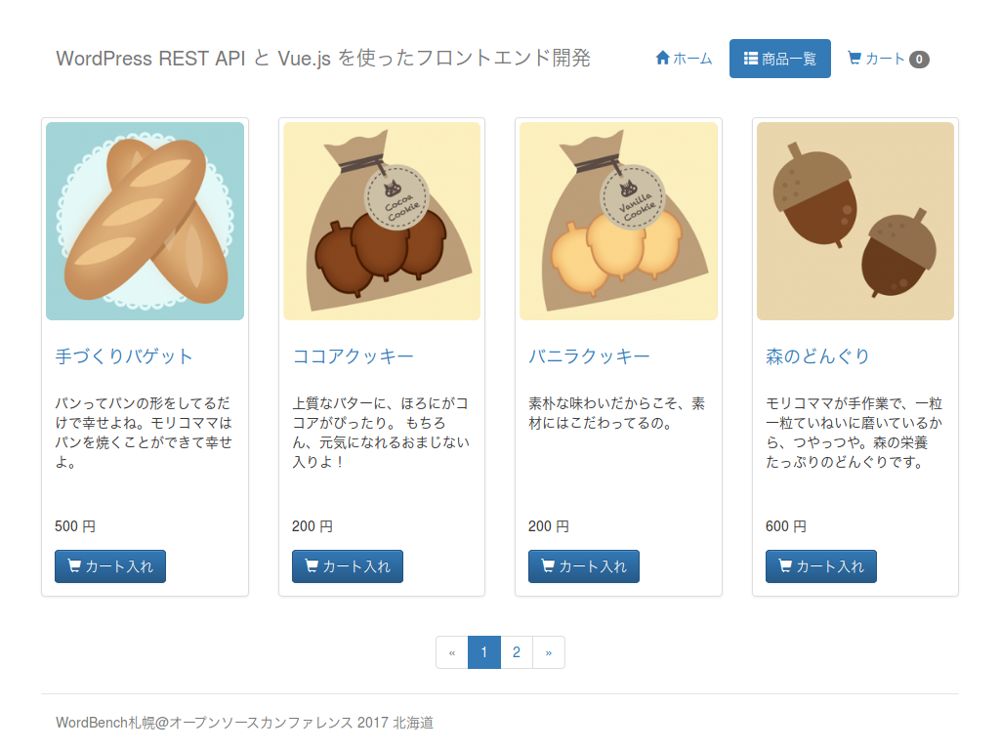

# OSC 2017 北海道 WP + Vue.js セミナーサンプルサイト

[動作](https://raw.githubusercontent.com/h1romas4/wp-vuejs-sample/master/doc/osc2017do-pre.mp4)

> [OSC 北海道 2017 baserCMS & WordPress セミナー・ブース出展](http://another.maple4ever.net/archives/2296/)
>
> 7/13, 14に開催されましたオープンソースカンファレンス 2017 北海道にて、baserCMS & WordPress セミナー・ブース出展を行ってきました。
>
> お越しになられた皆様、ご協力いただきました皆様、OSC スタッフの皆様、ありがとうございました！
>
> セミナーで使いましたスライドをこちらに公開いたします。

> [WordPress REST API と Vue.js を使ったフロントエンド開発](https://www.ospn.jp/osc2017-do/modules/eguide/event.php?eid=38)
>
> 世界中で利用される CMS である WordPress と、リアクティブ系 JavaScript ライブラリのひとつである
Vue.js を使ったウェブ・フロントエンド開発手法をサンプルサイトを元に具体的なソースコードとともに解説します。
WordPress をデーターベースとして利用したフロントエンド開発や、近年導入が進んでいるリアクティブ系の
JavaScript ライブラリの適用例を見たい方にお勧めです。

